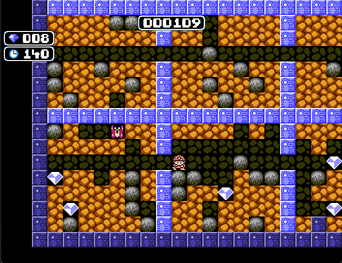

  

  <strong>Welcome to Boulder-Dash. A 2D tile-based game using Pascal and SDL.</strong>

  

## Getting Started

First, install a Pascal compiler.

Next, fork the repository. Then, go into your favorite terminal.

    git clone git@github.com:YOUR_USERNAME/boulder-dash.git
    cd boulder-dash

Now, while still inside the `boulder-dash` folder, compile the project and click on the main.exe.

## Systems and Engines

Here are the types of things I will be adding as a minimum viable product (alpha). Not too over the top but enough to cover the basics until more is added. Each section links to a project which will contain its sub-tasks within.

### Features?

Here is a non-exhaustive list of the features of this game.

- [Player]
  - [x] Walking
  - [x] Animations
- [User Interface]
  - [x] Level info
  - [x] Score
  - [x] Overall look &amp; feel
- [Ennemies]
  - [x] Spawning
  - [x] Player damage
  - [x] Walking around
  - [x] Pathfinding algorithm
- Map
  - [x] Respawn system
  - [x] Border limits
  - [x] File-based generation 
  - [x] Game skills
    - [x] Digging
